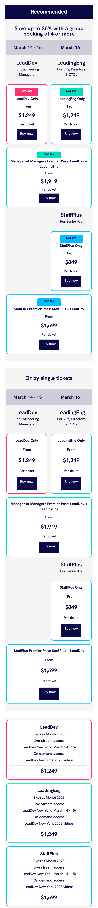

# Upwork - LeadDev ticket pricing component

This is a solution to the LeadDev ticket pricing component task on Upwork.

- [Overview](#overview)
  - [The task](#the-task)
  - [Screenshot](#screenshot)
  - [Links](#links)
- [My process](#my-process)
  - [Built with](#built-with)
  - [What I learned](#what-i-learned)
  - [Continued development](#continued-development)
  - [Useful resources](#useful-resources)
- [Author](#author)
- [Acknowledgments](#acknowledgments)

## Overview

### The task

Implement two responsive HTML and CSS components.

- Each ticket pricing block should be clickable.
- The implementation should allow the addition of different combinations of ticket pricing blocks.
- The ticket pricing button should be implemeted with the Tito plugin.
- The mouse-over state of the ticket pricing button should be implemented as per design.

### Screenshot

### Links
- Solution URL [https://github.com/javelwilson/leaddev-ticket-pricing-component](https://github.com/javelwilson/leaddev-ticket-pricing-component)
- Live Site URL [https://javelwilson.github.io/leaddev-ticket-pricing-component](https://javelwilson.github.io/leaddev-ticket-pricing-component)

## My Process

### Built with
- Semantic HTML5 markup
- CSS custom properties
- Flexbox
- CSS Grid
- Mobile-first workflow

### What I learned

### Continued development

### Useful resources

## Author

- Website: [Javel Wilson](https://javelwilson.com)

## Acknowledgments

